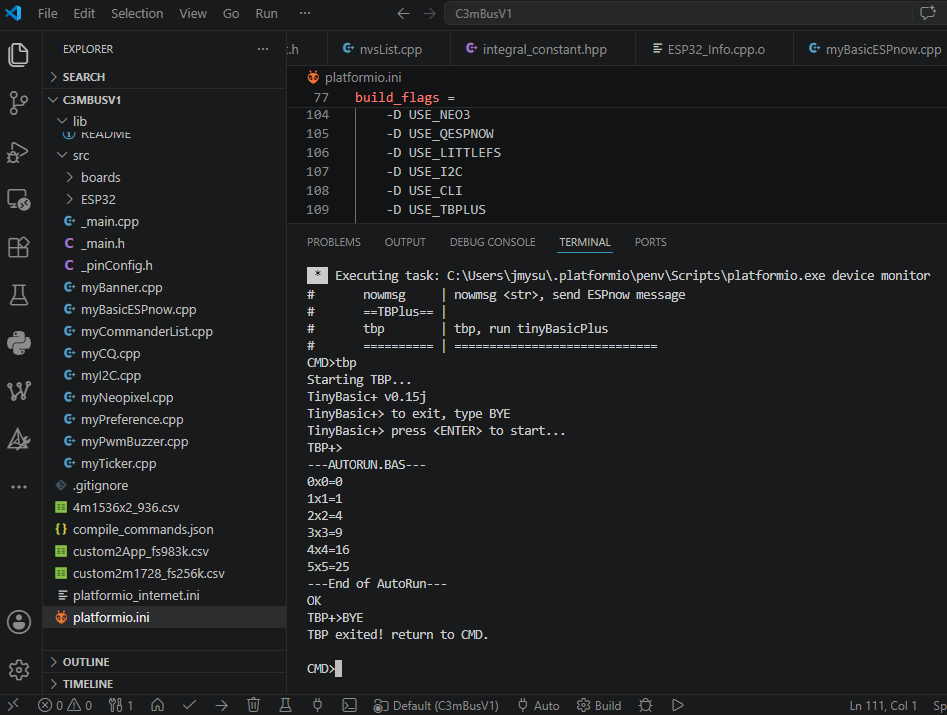

## Firmware files folder

PlatformIO projects...

with Arduino library V2! (Need some migration changes for V3...)

-----

### pinConfig, ESP32Info
  

### CLI, ESPnow
  

### CLI, TinyBasicPlus

---
## References
  - [Quick EspNOW](https://github.com/gmag11/QuickESPNow) A wireless protocol that allows devices links without AP.
  - [TinyBasic+](https://github.com/BleuLlama/TinyBasicPlus) A C implementation of Tiny Basic.  
  - [TinyBasic WiKi](https://en.wikipedia.org/wiki/Tiny_BASIC) TinyBasic Wikipedia page.  

