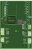

## Wokwi simulation files folder.
Create a new project, use F1 to load the custom board and start to simulate. [https://github.com/wokwi/wokwi-boards]

### Custom board: _mBusC3mini_V2605_

### Simple LED Blink
  

### Neopixels and LED Blink
   
